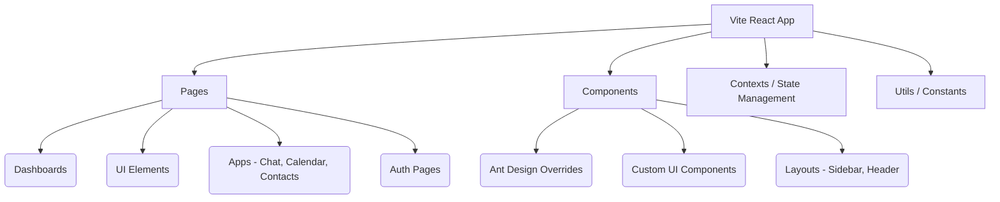
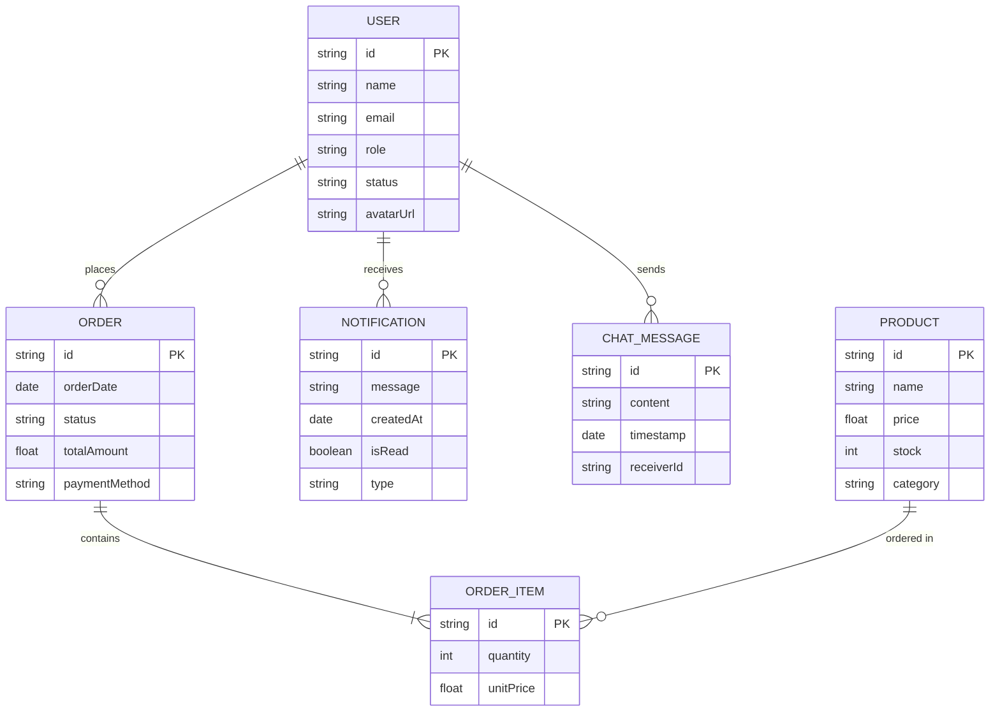

# Annakoot Admin Dashboard


**Live Demo:** [https://annakoot.vercel.app](https://annakoot.vercel.app)

Annakoot Admin Dashboard is a comprehensive, ultra-optimized, and feature-rich React-based administrative interface. Built with Vite, it guarantees lighting-fast hot module replacement (HMR), minimal bundle sizes, and an incredibly performant production build. It provides a vast array of UI components, form elements, charts, applications, and pre-built pages to jumpstart any SaaS or administrative backend project.

---

## 🚀 Features

- **Ultra-Optimized Build**: Fully configured Vite build with vendor chunk splitting, esbuild minification, and dependency pre-bundling.
- **Rich UI Library**: Dozens of pre-built UI components including Accordions, Avatars, Badges, Modals, Popovers, Tabs, and SweetAlerts.
- **Advanced Data Representation**: Interactive charts (Chart.js, Ant Design Charts), advanced data tables, and dynamic tree views.
- **Built-in Applications**: Ready-to-use application templates including Chat, Calendar, Contacts, and User Profiles.
- **Form Controls & Wizards**: Complete set of form inputs, complex form wizards, color pickers, date pickers, and rich text editors (Jodit).
- **Authentication Pages**: Beautifully designed login, register, and security screens.
- **Interactive Maps**: Vector maps for geographical data visualization.
- **Fully Responsive**: Flawless experience across desktops, tablets, and mobile devices.

---

## 🛠️ Technologies Used

- **Framework**: React 18
- **Build Tool**: Vite (with SWC for instant compiling)
- **Styling & UI**: Ant Design (antd), Tailwind CSS (or Custom Utilities)
- **Charts**: Chart.js, React-Chartjs-2, @ant-design/charts
- **Icons**: Iconsax, Remixicon
- **Routing**: React Router DOM v6
- **Additional Libraries**: Swiper, SweetAlert, React Vector Maps, Jodit-React, React-OTP-Input

---

## 🏗️ Architecture Diagrams

### System Architecture

The frontend is modularized for scalable development.



### Entity-Relationship (ER) Diagram

A representation of the underlying data structures this dashboard is designed to manage.



---

## 💻 Getting Started

### Prerequisites

Ensure you have [Node.js](https://nodejs.org/) installed on your machine.

### Installation & Execution

1. **Clone the repository** (if not already cloned)
   ```bash
   git clone <your-repository-url>
   cd Annakoot-Admin-Dashboard
   ```

2. **Install dependencies**
   ```bash
   npm install
   ```

3. **Start the development server**
   ```bash
   npm run dev
   ```
   The application will be accessible at `http://localhost:5173/`.

4. **Build for Production**
   ```bash
   npm run build
   ```
   This will generate a highly optimized `dist` folder ready for deployment.

---

## 🔮 Future Functionalities

- **Dark Mode Integration**: Full system-wide theming for light and dark modes with persistent user preferences.
- **Global State Management**: Transitioning complex prop-drilling to Redux Toolkit or Zustand for better state predictability.
- **Backend API Integration**: Connect the mock UI state directly to a live RESTful or GraphQL API backend.
- **Multi-language Support (i18n)**: Adding localization for global accessibility.
- **Automated Testing**: Integrating Cypress for End-to-End (E2E) testing and Vitest for unit testing critical components.
- **Drag and Drop Board**: Introducing a Kanban board layout for task management functionalities.
